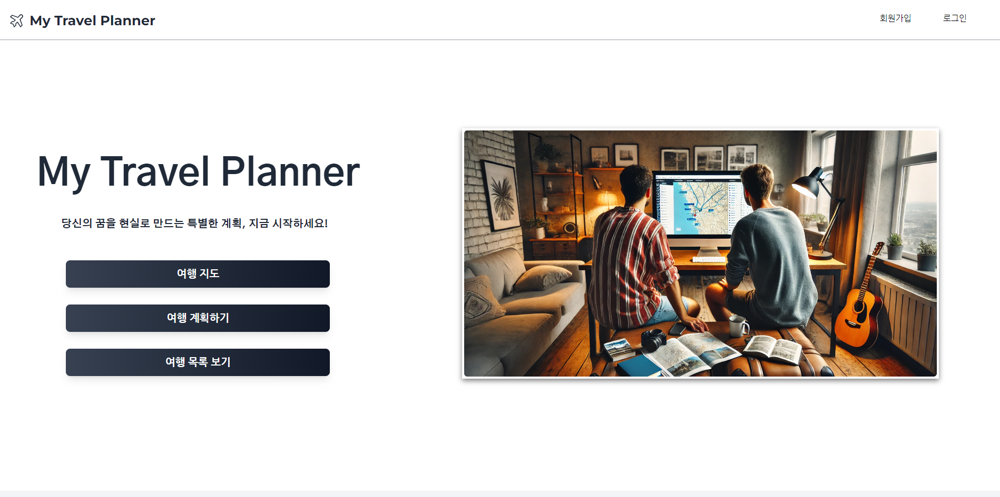
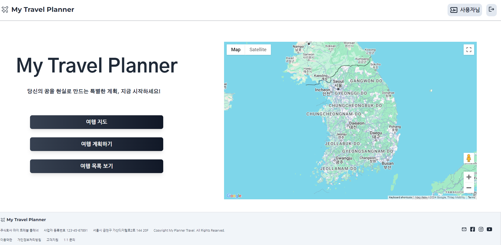
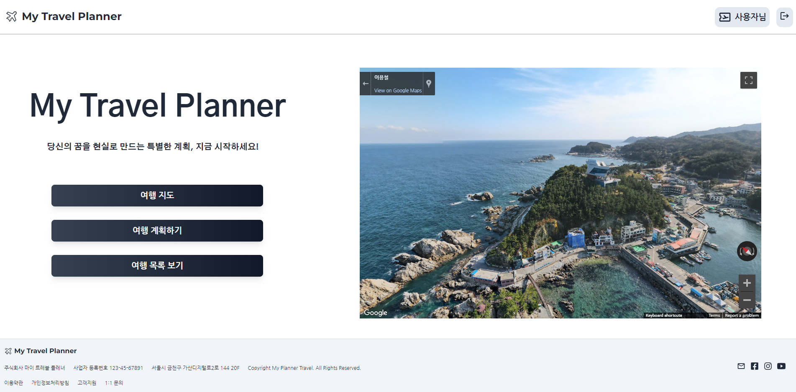
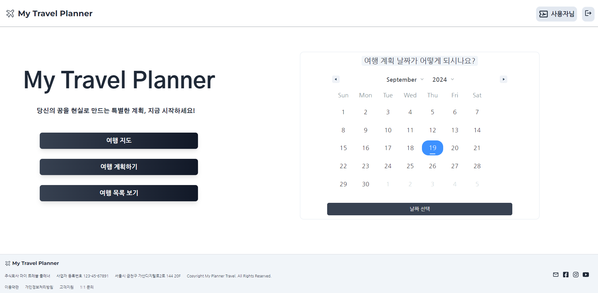
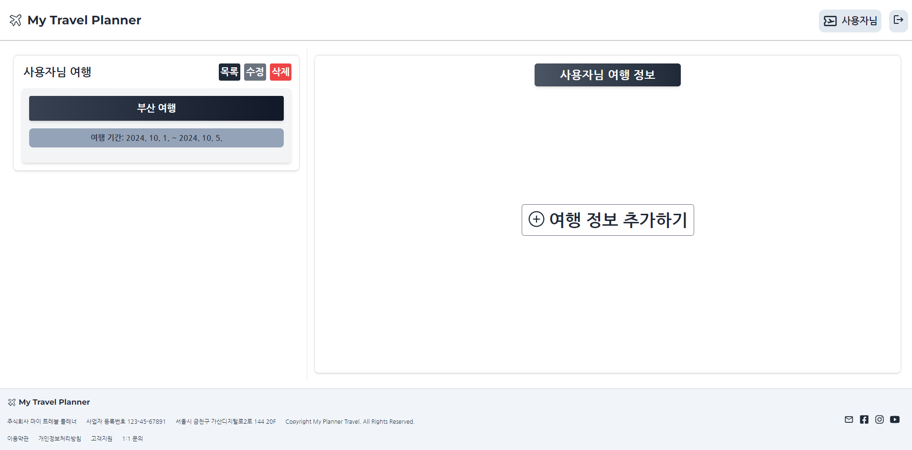
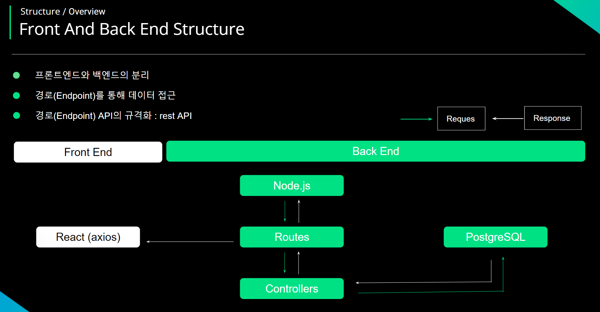

# CRM Service Project 

### My Travel Planner

<p align="center">
  
</p>


</p>

# 1. 프로젝트 소개 & 목적


### 프로젝트 소개
  
  *  AI를 통해 여행 계획을 작성하는 웹은 있습니다.
  
  
  *  사용자가 달력으로 여행 날짜, 장소, 정보 작성 하는 웹은 없습니다.
  

  * 여행 계획 뿐만 아니라 사용자가 방문했던 장소를 사진을 등록하고 여행 정보를 작성 할 수 있는 시스템


### 프로젝트 목적

  * 구글 지도 제공하여 로드맵 확인 가능


  * 일정 계획을 통해 캘린더에서 날짜를 선택하여 목록 생성


  * 여행 장소를 시 우측에 내가 적었던 여행 정보 표현, 수정 및 삭제 가능


# 2. 개발 환경

### 기술 스택

* React 

```
# 📦 Front - React App
├── 📂 .github
│   └── 📂 workflows
│       └── 📄 cicd.yml (CI/CD 파이프라인 설정 파일)
│
├── 📂 build
│   └── 📄 (빌드된 파일들)
│
├── 📂 node_modules
│   └── 📄 (의존성 모듈들)
│
├── 📂 public
│   └── 📄 (정적 파일들)
│
├── 📂 src
│   ├── 📂 Component
│   │   ├── 📂 Auth
│   │   │   └── 📄 (인증 관련 컴포넌트)
│   │   ├── 📂 Home
│   │   │   └── 📄 (홈 페이지 컴포넌트)
│   │   ├── 📂 Calendarpage
│   │   │   └── 📄 (캘린더 페이지 컴포넌트)
│   │   ├── 📂 Map
│   │   │   └── 📄 (지도 관련 컴포넌트)
│   │   ├── 📂 Planner
│   │   │   └── 📄 (플래너 관련 컴포넌트)
│   ├── 📄 Apps.js
│   └── 📄 Index.css
│
├── 📄 dockerfile
│   └── 📄 (Docker 설정 파일)
│
├── 📄 nginx.conf
│   └── 📄 (Nginx 설정 파일)
│
├── 📄 package.json
│   └── 📄 (의존성 및 프로젝트 정보)
│
└── 📄 README.md
```

# 3. 구현 기능

### Google 지도 

* 여행 계획 시 참조할 지도

<p align="center">
  
</p>


* Google 지도 로드맵 기능 지원

<p align="center">
  
</p>

```
const containerStyle = {
  width: '50%', // 컨테이너 너비 설정
  height: '600px', // 컨테이너 높이 설정
  marginLeft: '5%', // 왼쪽 여백 설정
};

// 한반도의 중심 위치 (위도, 경도)
const center = {
  lat: 36.5, // 한반도 중심 위도
  lng: 127.5, // 한반도 중심 경도
};

const GoogleMapComponent = () => {

  // Google Maps API 로딩 상태 확인
  const { isLoaded } = useJsApiLoader({
    id: 'google-map-script', // 스크립트 ID
    googleMapsApiKey: process.env.REACT_APP_MAP_API_KEY, // 환경 변수에서 API 키 가져오기
  });

  // 지도 로딩이 완료되면 GoogleMap 컴포넌트를 반환
  return isLoaded ? (
    <GoogleMap mapContainerStyle={containerStyle} center={center} zoom={7} /> // 지도 설정
  ) : (
    <div>Loading</div> // 로딩 중 표시
  );
};

export default GoogleMapComponent; // 컴포넌트 내보내기
```

### 달력


* React - NPM 달력 모듈


* 디자인 커스텀 가능, 달력 날짜 선택 가능


* 참고 사이트 : https://www.npmjs.com/package/react-date-range


<p align="center">
  
</p>


```
<DateRangePicker
    anges={[selectionRange]} // 선택된 날짜 범위
    onChange={handleSelect} // 날짜 선택 시 호출되는 함수
    className="w-full custom-calendar"
    staticRanges={[]} // 프리셋 범위 비활성화
    inputRanges={[]} // 입력 범위 비활성화
    // locale={ko} // 한국어 로케일 설정
/>

index.css

/* 캘린더 커스텀 텍스트 */
.custom-calendar .rdrCalendarWrapper {
  font-size: 1.2rem; /* 기본 글꼴 크기 조정 */
  color: #1f2937; /* 텍스트 색상 설정 (회색-700) */
  width: 100%; /* 너비 100% 설정 */
}

.custom-calendar .rdrMonthAndYearPickers select,
.custom-calendar .rdrMonthPicker select,
.custom-calendar .rdrYearPicker select {
  font-size: 1.2rem; /* 드롭다운 글꼴 크기 조정 */
}

.custom-calendar .rdrDayNumber span {
  font-size: 1.2rem; /* 날짜 번호 글꼴 크기 조정 */
}

.custom-calendar .rdrDayToday span {
  font-size: 1.25rem; /* 오늘 날짜 글꼴 크기 조정 */
}

.custom-calendar .rdrDateDisplay {
  display: none; /* 날짜 표시 숨김 */
}

.custom-calendar .rdrWeekDay {
  font-size: 1.2rem; /* 주중 이름 글꼴 크기 조정 */
  text-align: center; /* 중앙 정렬 */
}

.rdrDefinedRangesWrapper {
  display: none; /* 정의된 범위 숨김 */
}
```


### 여행 목록 생성


<p align="center">
  
</p>


```
 useEffect(() => {

    // 컴포넌트가 처음 렌더링될 때 서버에서 데이터를 가져옴
    const fetchCalendarData = async () => {
      try {

        // 서버에 GET 요청을 보내서 데이터를 받아옴
        const response = await axios.get(
          `https://plannerback.guswldaiccproject.com/get_calendar_date/${authData.user_idx}`
        );

        // 서버에서 응답받은 데이터가 있을 때 처리
        if (response.data && response.data.length > 0) {
          // 서버에서 받아온 첫 번째 데이터에서 필요한 값들을 가져옴
          const { project_idx, start_date, end_date } = response.data[0];

          // 받아온 프로젝트 ID와 날짜를 상태 값에 설정
          setProjectIdx(project_idx);
          setStartDate(subtractOneDay(start_date) || ''); // 시작 날짜를 하루 빼서 설정
          setEndDate(subtractOneDay(end_date) || ''); // 종료 날짜도 하루 빼서 설정
        }
      } catch (error) {
        // 데이터를 가져오는 중에 오류가 발생하면 콘솔에 출력
        console.error('캘린더 데이터를 가져오는 중 오류 발생:', error);
      }
    };

    // 함수 호출 (서버에서 데이터 가져옴)
    fetchCalendarData();
  }, [authData.user_idx]); // 사용자 ID가 변경될 때마다 데이터를 다시 가져옴
```

# 4. 배포 


### FRONT & BACK FLOW CHART


<p align="center">
  
</p>


```
# Front Deploy

## Deploy Structure
├── 📦 Docker Hub
│   ├── 🐳 Node 이미지
│   ├── 🏗️ Build 이미지
│   └── 🌐 Nginx 이미지
│
├── ☁️ AWS
│   ├── 🖥️ EC2 인스턴스
│   │   ├── 🔒 SSL HTTPS 인증서
│   │   ├── 🌐 Route 53
│   │   └── 📡 CloudFront
│   │
│   └── 🔧 설정
│       ├── 🔑 보안 그룹
│       ├── 📜 IAM 역할
│       └── 🌍 VPC 설정
│
└── 🚀 GitHub Actions
    ├── ⚙️ .github/workflows/cicd.yml
    ├── 📄 GitHub 환경 파일
    └── 🏃 Action Runner
```


# 5. 트러블 슈팅


### 지도 표현이 되지 않는 ERROR


* isloaded 함수를 사용하여 이전의 지도를 그대로 표현


* 여행 지도 클릭 시 화면 표현


```

Google Map - isloading

const GoogleMapComponent = () => {

  const { isLoaded } = useJsApiLoader({

    id: 'google-map-script',
    googleMapsApiKey: process.env.REACT_APP_MAP_API_KEY,
  });

  return isLoaded ? (
    <GoogleMap mapContainerStyle={containerStyle} center={center} zoom={7} />
  ) : (
    <div>Loading</div>
  );
};
```


### 캘린더 날짜 랜덤 ERROR


* 페이지 로드 시 오늘 날짜로 가져올 수 있게 startDate : today, endDate: today 설정 


```
calendar - today 값으로 나오지 않음

  useEffect(() => {

    // 페이지가 로드될 때 오늘 날짜로 기본 설정
    const today = new Date();
    setSelectionRange({
      startDate: today,
      endDate: today,
      key: 'selection',
    });

    // fetchCalendarData();

  }, []); // 컴포넌트가 마운트될 때 한 번만 실행
```

# 6. 개발 후기


### 아쉬운 점 & 배운점


* Front 데이터를 가져오는 과정을 알 수 있게 되었습니다.
  
* tailwindcss, index.CSS 와 useEffect, useState를 통해 프로젝트에 녹일 수 있어 좋았습니다.

* 변수가 많아 트러블 슈팅 시 문제점을 찾기 어려웠습니다.

* redux를 사용하지 못해 아쉽습니다. axios로 데이터를 가져오고 user_idx(authData) , modal에 적용하였습니다.
